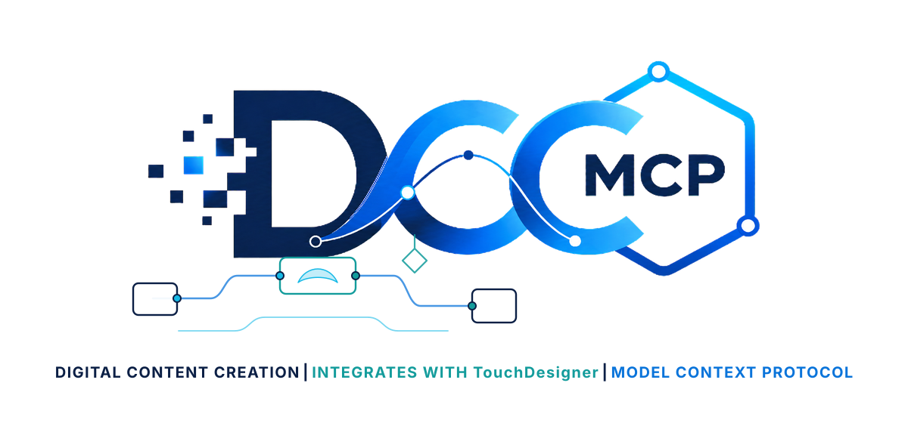

# dcc-mcp-touchdesigner

<p align="center">
  
</p>

Typed, main-thread-safe TouchDesigner control for the [DCC Model Context Protocol](https://github.com/dcc-mcp/dcc-mcp-core).

The adapter embeds the DCC-MCP HTTP runtime in TouchDesigner, registers the instance with the local gateway, and executes TouchDesigner API work through the documented `td.run()` scheduler. Agents can inspect and edit operator networks, set parameters, save projects, and export TOP images without sending TouchDesigner objects to background threads.


_Illustrative workflow visualization generated with OpenAI ImageGen from the retained source in `docs/images/sources`. It is not a TouchDesigner screenshot or host-validation artifact. The header uses an approved operator-network reference motif rather than an official host mark._

## Install

TouchDesigner 2025 uses Python 3.11. Install this package into a matching external environment and expose that environment to TouchDesigner. The preferred TouchDesigner 2025 route is the built-in `TDPyEnvManager`; the Preferences dialog's external Python module path is also supported.

```powershell
py -3.11 -m venv .venv
.\.venv\Scripts\python -m pip install --upgrade pip
.\.venv\Scripts\python -m pip install dcc-mcp-touchdesigner
```

See [install.md](install.md) for the complete Windows and macOS setup, dependency isolation guidance, and startup configuration. TouchDesigner documents both [external Python packages](https://docs.derivative.ca/Python#Installing_Custom_Python_Packages) and the [TDPyEnvManager](https://docs.derivative.ca/Palette%3AtdPyEnvManager).

## Start in TouchDesigner

Run this from the Textport or an Execute DAT `onStart()` callback:

```python
import dcc_mcp_touchdesigner

server = dcc_mcp_touchdesigner.start_server()
print(server.mcp_url)
```

`start_server()` is idempotent inside one TouchDesigner process. It loads the bundled skill by default, selects an OS-assigned loopback port, starts the main-thread pump, and advertises the instance to a running DCC-MCP gateway. Stop it explicitly during project teardown when needed:

```python
dcc_mcp_touchdesigner.stop_server()
```

## Typed tools

| Tool | Contract | Risk |
| --- | --- | --- |
| `get_project_info` | Read project name, folder, build, cook rate, and root count | Read-only |
| `list_operators` | List direct or recursive operators with an optional family/type filter | Read-only |
| `get_op_parameters` | Read selected or all parameters from one operator | Read-only |
| `create_operator` | Create a documented operator type under an explicit COMP | Mutation |
| `connect_operators` | Connect an explicit output connector to an explicit input | Mutation |
| `set_op_parameter` | Set one parameter and return its evaluated value | Idempotent mutation |
| `capture_top` | Save one TOP to an explicit PNG path with size and SHA-256 metadata | File write |
| `save_project` | Save the current project to an explicit `.toe` path | File write |
| `delete_operator` | Delete one explicitly addressed non-root operator | Destructive |
| `execute_python` | Advanced in-host Python escape hatch; disabled by policy when required | Destructive |

Every tool has a JSON input/output contract and is dispatched on TouchDesigner's main thread. File-writing tools require an explicit path and reject accidental overwrite unless `overwrite=true` is supplied. Root deletion is always rejected.

## Security controls

Disable arbitrary Python execution in controlled environments before starting TouchDesigner:

```powershell
$env:DCC_MCP_TOUCHDESIGNER_DISABLE_EXECUTE_PYTHON = "1"
```

The adapter binds to loopback by default. Do not expose the per-instance port directly to an untrusted network. Use the DCC-MCP gateway when multiple instances or attributable agent sessions are required.

## Runtime configuration

| Variable | Purpose |
| --- | --- |
| `DCC_MCP_TOUCHDESIGNER_SKILL_PATHS` | Additional skill directories |
| `DCC_MCP_TOUCHDESIGNER_METRICS` | Enable Prometheus `/metrics` |
| `DCC_MCP_TOUCHDESIGNER_ENABLE_GATEWAY_FAILOVER` | Enable gateway failover; on by default |
| `DCC_MCP_TOUCHDESIGNER_DISABLE_EXECUTE_PYTHON` | Disable the advanced Python tool |

## Development

```powershell
py -3.11 -m pip install -e ".[dev]"
pytest
ruff check .
ruff format --check .
dcc-mcp-cli lint src/dcc_mcp_touchdesigner/skills/touchdesigner-scripting --warnings-as-errors
python -m build
python -m twine check dist/*
```

Unit and contract tests use a deterministic TouchDesigner API double. A release additionally requires a real TouchDesigner process, six readiness checks, discovery of all ten typed tools, and a create/connect/set/capture/save/delete chain through `dcc-mcp-cli`; simulation alone is not release evidence.

## License

MIT
